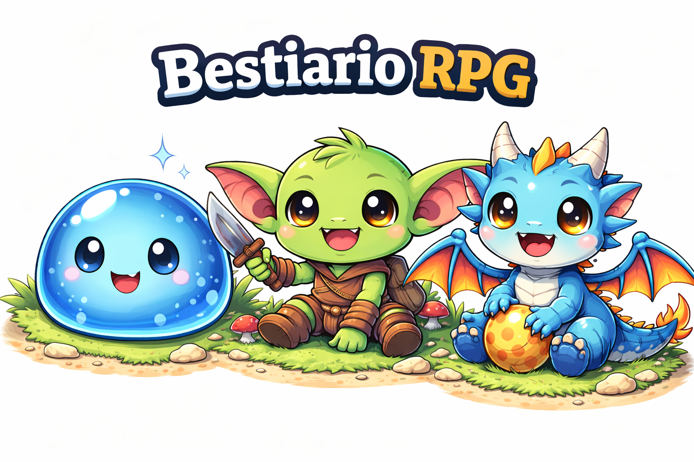

# 🐲 Bestiario RPG

Aplicacion Android desarrollada como feedback de la asignatura.  
La idea es un **bestiario de monstruos RPG**, donde se pueden añadir, editar, ver y eliminar criaturas, guardando todo en una base de datos SQLite.

El objetivo principal del proyecto ha sido **cumplir todos los requisitos del feedback**, sin complicar de mas la aplicacion, pero cuidando la estructura y el funcionamiento.

---

## 🎯 Objetivo del proyecto

Desarrollar una aplicacion Android que:

- Use varias Activities
- Muestre informacion con ListView y adaptadores
- Almacene datos en una base de datos SQLite
- Permita altas, modificaciones, consultas y borrados
- Incluya menus, dialogos y una pantalla “Acerca de”
- Sea instalable directamente mediante una APK

---

## 📱 Funcionamiento general

La aplicacion sigue un flujo muy sencillo:

1. **Pantalla de inicio (Splash)**
    - Muestra la imagen del bestiario
    - Muestra la version de la app
    - Al tocar la pantalla se accede a la aplicacion

2. **Pantalla principal**
    - Muestra la lista de monstruos en un `ListView`
    - Cada fila tiene imagen, nombre, nivel y estado (derrotado)
    - Desde el menu se puede:
        - Añadir un nuevo monstruo
        - Filtrar monstruos derrotados
        - Ver el dialogo “Acerca de”

3. **Pantalla de detalle**
    - Muestra la informacion completa del monstruo
    - Imagen chibi segun el tipo
    - Opcion de editar o eliminar el monstruo
    - Eliminacion con dialogo de confirmacion

4. **Pantalla de añadir / editar**
    - Formulario para introducir o modificar los datos
    - Validaciones basicas de nombre y nivel
    - Selector de tipo mediante Spinner

---

## 🧱 Estructura de la aplicacion

### Activities

- **SplashActivity**
    - Pantalla de inicio
    - Solo sirve para mostrar la imagen y pasar a la principal

- **MainActivity**
    - Pantalla principal con el ListView
    - Gestiona el menu principal y el filtro

- **DetailActivity**
    - Pantalla de detalle del monstruo
    - Permite editar y eliminar

- **EditMonsterActivity**
    - Formulario para añadir o editar monstruos

---

### Base de datos (SQLite)

La base de datos se gestiona con la clase:

- **DBHelper**

Aqui se define:
- La tabla de monstruos
- Los campos (id, nombre, nivel, derrotado, tipo)
- Las operaciones CRUD:
    - Crear
    - Leer
    - Actualizar
    - Borrar

Al arrancar por primera vez se insertan algunos datos de ejemplo para que la app no aparezca vacia.

---

### Modelo y adaptador

- **Monster**
    - Clase modelo que representa un monstruo
    - Contiene los datos que vienen de la base de datos

- **MonsterAdapter**
    - Adaptador del ListView
    - Se encarga de pintar cada fila usando `row_monster.xml`
    - Asigna la imagen chibi segun el tipo del monstruo

---

## 🎨 Interfaz y recursos

- **ListView** para mostrar la lista
- **ImageView** para las imagenes chibi
- **TextView** para nombre y nivel
- **CheckBox** para indicar si esta derrotado
- **Button** para acciones
- **Spinner** para seleccionar el tipo de monstruo

Las imagenes chibi se encuentran en `res/drawable` y se asignan dinamicamente segun el tipo del monstruo.

---

## 🧭 Menus y dialogos

La aplicacion usa un menu comun que se adapta segun la pantalla:

- En la pantalla principal:
    - Añadir
    - Filtrar
    - Acerca de

- En el detalle:
    - Editar
    - Eliminar
    - Acerca de

- En editar:
    - Solo “Acerca de”

Los dialogos se usan para:
- Confirmar eliminaciones
- Mostrar informacion “Acerca de”

---

## 📦 APK instalable

Dentro del repositorio se incluye una version instalable de la aplicacion:

📁 `apk/app-debug.apk`

### Pasos para instalar:
1. Descargar la APK
2. Activar la instalacion desde origenes desconocidos
3. Abrir la APK en el dispositivo Android

No es necesario compilar el proyecto para probar la aplicacion.

---

## 🔮 Posibles mejoras

Algunas mejoras que se podrian añadir en el futuro:

- Ordenar monstruos por nivel o nombre
- Buscar monstruos
- Editar el estado derrotado directamente desde la lista
- Añadir mas tipos de monstruos
- Guardar imagen personalizada por monstruo
- Soporte para multiples idiomas

---

## 👤 Autor

Juanma  
Proyecto desarrollado como feedback de la asignatura de Android.

